# Часто задаваемые вопросы для 1 курса

> [!NOTE]
> Этот список может быть актуален в первые дни после заселения. А дальше перваки сами разберутся - только дай шанс с:

__Оглавление__

* [Заселение, проживание](#%D0%B7%D0%B0%D1%81%D0%B5%D0%BB%D0%B5%D0%BD%D0%B8%D0%B5-%D0%BF%D1%80%D0%BE%D0%B6%D0%B8%D0%B2%D0%B0%D0%BD%D0%B8%D0%B5)
* [Бытовые вопросы](#%D0%B1%D1%8B%D1%82%D0%BE%D0%B2%D1%8B%D0%B5-%D0%B2%D0%BE%D0%BF%D1%80%D0%BE%D1%81%D1%8B)
* [Как добраться до института / в Москву](#%D0%BA%D0%B0%D0%BA-%D0%B4%D0%BE%D0%B1%D1%80%D0%B0%D1%82%D1%8C%D1%81%D1%8F-%D0%B4%D0%BE-%D0%B8%D0%BD%D1%81%D1%82%D0%B8%D1%82%D1%83%D1%82%D0%B0--%D0%B2-%D0%BC%D0%BE%D1%81%D0%BA%D0%B2%D1%83)
* [Полезные ссылки](#%D0%BF%D0%BE%D0%BB%D0%B5%D0%B7%D0%BD%D1%8B%D0%B5-%D1%81%D1%81%D1%8B%D0%BB%D0%BA%D0%B8)

## Заселение, проживание

* __Процесс заселения в Студгородок__

Заселение в общежитие происходит по адресу г. Москва, Зеленоград, ул. Юности, д. 11 (вход во все корпуса общий).

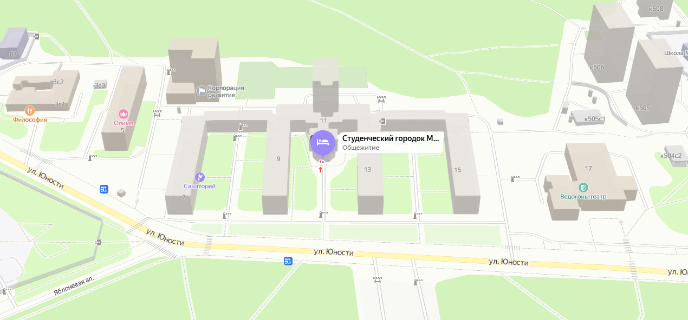

После входа в Студгородок вас встречает зона ожидания перед пропусным пунктом. Здесь стоит ознакомиться со списком заселения, узнать, *в какой корпус* вы заселены. Далее необходимо подойти к волонтеру, который направляет заселяющихся в соответствующие корпуса в соответствие с очередью.

По направлению волонтера вы подойдете для получения *противогаза* и затем к *стойке информации*, где волонтёры помогут подготовить документы. Среди них фотографии 3х4, справки о здоровье и так далее.

Далее вы проходите в свой корпус и с волонтерами при входе в корпус оформляете договор на проживание. С заполненным договором проходите к комменданту корпуса.

* __Что делать сразу после заселения__.

Получить постельное бельё. Обменяться контактами с соседями. Провести полную уборку комнаты: протереть от пыли полки, столы, подоконник; по очереди выдвинуть кровати и столы от каждой стороны комнаты, вымести и вымыть полы. Задвинуть обратно и вымыть центральный проход. Примерно так же с предбанником. Потом вы это делать не будете, потому что заставите всё вещамии. 

* __Где получать постельное бельё. Как часто его меняют__.

Матрас, подушка и одеяло выдаются на 2 этаже напротив комнаты 219 (железная дверь). Постельное бельё (простыня, пододеяльник, наволочка) выдается напротив комнаты 233. Обмен постельного белья производится там же, как правило, раз в 2 недели. Перед этим вывешивается объявление у 210 комнаты. 

* __Остались вещи от предыдущих жильцов__.

Часто четверокурсники оставляют микроволновки, холодильники, матрасы на продажу. Тогда они оставляют свои контакты в комнате, на столе. Некоторые просто не успевают вывезти все свои вещи. Иначе это могут быть вещи старшекурсника, к которому вас подселили - вам всегда скажут, если подселяют.

* __Хотим сделать ремонт__.

Ремонт – дело хорошее. Стены – желательно красить; клеить обои разрешается , только если в комнате до этого были обои. Потолочную плитку наклеивать не стоит. Можете посоветоваться с комендантом, если не уверены.

* __В комнате не работает свет / нужно перевесить полку__.

Заявки на ремонт оставляются у коменданта. В студгородке есть штатные столяра, электрики, сантехники. Исключения – замена лампочек в люстре (E14/E27), это сами. _(см. полезные ссылки)_

## Бытовые вопросы

* __Где купить бытовую технику, холодильник, микроволновку.__

Группа ВК “Бартер Студгородок МИЭТ”: [vk.com/barter_miet](http://vk.com/barter_miet).

Ближайшие магазины: [dns-shop.ru](http://dns-shop.ru), [citilink.ru](http://citilink.ru), [onlinetrade.ru](http://onlinetrade.ru), [mvideo.ru](http://mvideo.ru).

Холодильники могут доставить с Озона, нужно уточнить способ доставки. Есть возможность подвезти холодильник к подъезду прямо вашего корпуса (двери, открывающиеся с лестниц) - с этим вопросом к коменданту.

* __Где купить уборочный инвентарь, хозяйственные товары.__

[“Атак”, Яблоневая аллея, к.313Б](https://yandex.ru/maps/-/CDQ6nNjg).
[“Fix Price”, Центральный проспект, к.406.](https://yandex.ru/maps/-/CDQ6nRix)
[“Молоток” к.426 (по Яблоневой аллее и еще 300м вперед после перекрестка вдоль школы).](https://yandex.ru/maps/-/CDQ6nR87)
[“Леруа Мерлен” и “Ашан” в ТЦ Зеленопарк.](https://yandex.ru/maps/-/CDQ6nRPT)

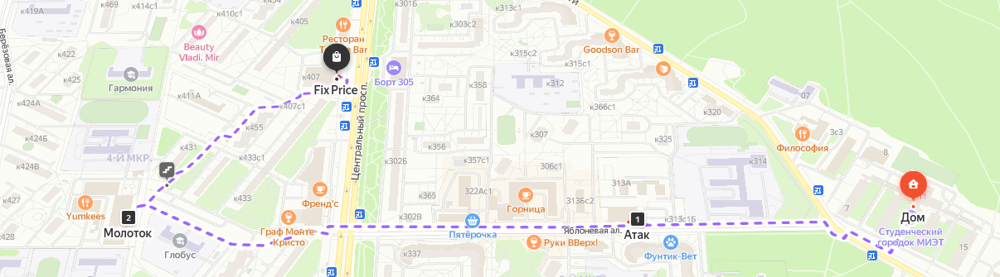

* __Продовольственные магазины рядом.__

“Ашан”, “ВкусВилл”, "Чижик" и “Пятерочка” на Яблоневой аллее. Парочка магазинчиков там же внутри дворика. “Пятерочка”, “Магнит” на улице Юности. “Перекресток” на площади Юности. “Верный” и “Азбука Вкуса” к.514. 

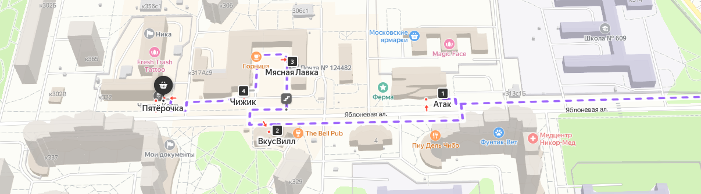

* __Перекусить рядом.__

Несколько кафетериев, пекарня и “KFC” на площади Юности. “Это кафе” к.402 рядом с пл.Юности. “Френдc” в конце Яблоневой аллеи. Шаурма рядом с "Молотком".

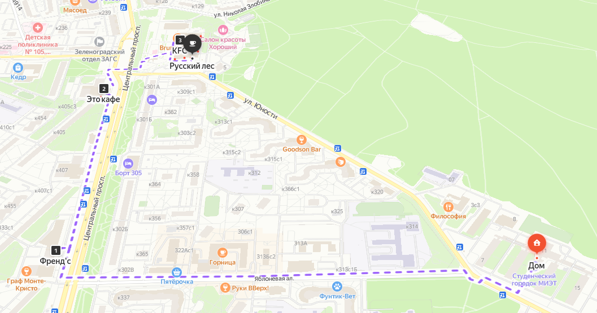

* __Дубликат ключей, фотоателье__

Яблоневая Аллея, к.317 – ключи рядом с "Чижиком", там же фотосалоны (обращайте внимание на отзывы). Фотобит и ЗелКей в к.234 (это чуть дальше площади Юности).

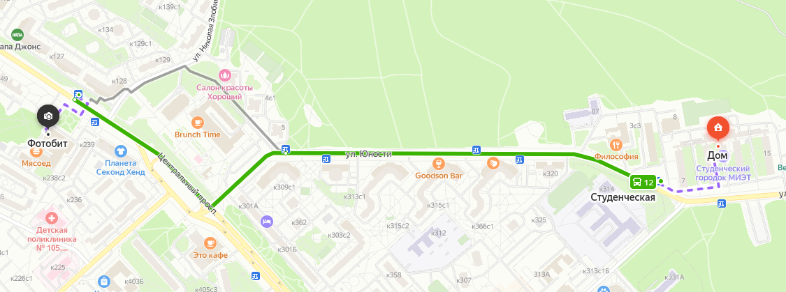

* __Какой удлинитель купить.__

Для крупной бытовой техники (чайник, микроволновка) недопустимо использовать удлинители “подешевле”. Рекомендуемый минимум: удлинитель с нагрузочной способностью 10 А / 2.3 кВт; лучше: 16 А / 3.7 кВт. Такой нагрузке соответствует сечение кабеля 3x1 мм2, 3x1.5 мм2, 3x2.5 мм2.Пример: [onlinetrade.ru](http://onlinetrade.ru) [арт. 3233279](https://www.onlinetrade.ru/catalogue/setevye_filtry_udliniteli_troyniki-c171/iek/udlinitel_iek_3kh3m_s_zazeml_16a_250v_u03_uno_2p_pe_3kh1.5kv.mm_wyp53_16_03_03_z-3233279.html), [арт. 2269096](https://www.onlinetrade.ru/catalogue/setevye_filtry_udliniteli_troyniki-c171/5bites/setevoy_filtr_5bites_sp5w_330_5_rozetok_16a_3m_belyy-2269096.html); [dns-shop.ru](http://dns-shop.ru) [арт. 1345061](https://www.dns-shop.ru/product/49e178e73b143332/setevoj-filtr-finepower-standard-630b-cernyj/).Для остальной техники с меньшей мощностью (ноутбук, монитор, ПК) допустимы сетевые фильтры с заявленной нагрузочной способностью 10 А / 2.3 кВт и сечением 3x0.75 мм2 и больше.Пример: [onlinetrade.ru](http://onlinetrade.ru) [арт. 2351117](https://www.onlinetrade.ru/catalogue/setevye_filtry_udliniteli_troyniki-c171/5bites/setevoy_filtr_5bites_sp5b_110_5s_3_0.75mm2_1m_black-2351117.html), [арт. 3160486](https://www.onlinetrade.ru/catalogue/setevye_filtry_udliniteli_troyniki-c171/kosmos_elektro/setevoy_filtr_kosmos_4kh1.5m_s_zazeml_10a_ip20_2.2kvt_s_pred_3kh0.75_indik_seti_belyy_fksm1.5m_4g_w-3160486.html).

* __Выделенная на комнату мощность__

Как правило, две-три комнаты объединяются под одним автоматическим выключателем номинала 16А, что допускает долговременное потребление до 4 кВт и кратковременное (до получаса) до 5 кВт. Чтобы никогда не превысить выделенную мощность, рекомендуется не включать одновременно более одного мощного электроприбора: чайник, микроволновка. Не берите плиты, даже если привезли с родителями: на кухнях отличные плиты.

* __Как часто ходить на пары, что нужно купить к занятиям.__

Все вопросы до мелочей будут доведены кураторами на собраниях и в беседе и группе ВК. Тетрадей обычно все покупают столько, что до 4 курса остаются. Ноутбук с собой носить не требуется; обычно он нужен ближе к 4 курсу, перед ВКР.
 

## Как добраться до института / в Москву.

Приложение Яндекс Карты, Яндекс Метро – лучший ориентир в Москве.

__До МИЭТ__: 

19 автобус от ост. Студенческая (со стороны Студгородка).

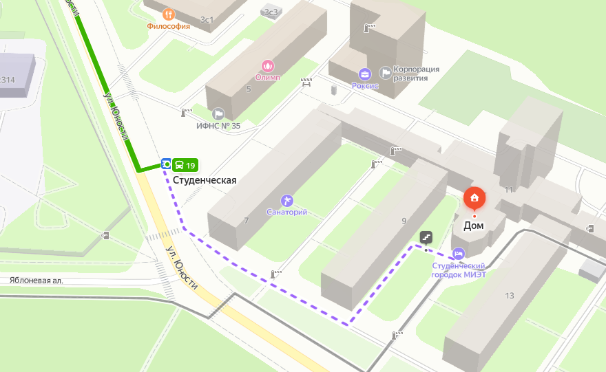
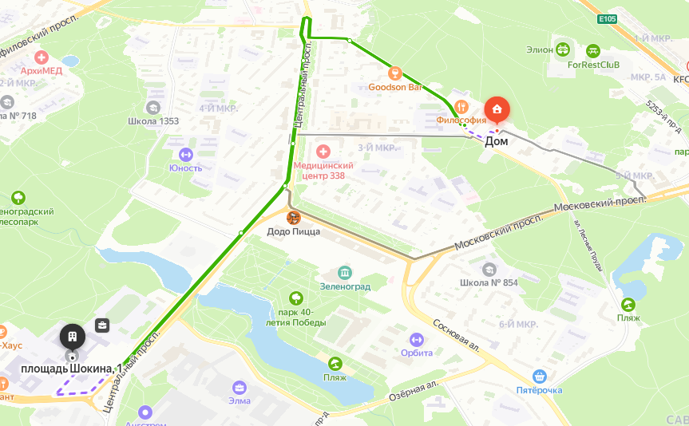

Либо пешком вдоль Яблоневой аллеи до ост. Дом Быта, через дорогу (остановка в сторону Крюково): автобусы 3, 3к, 8, 11, 19, 29, 32. Чуть быстрее.

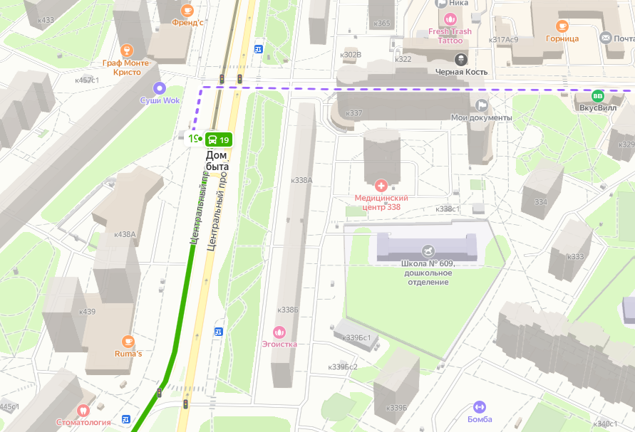
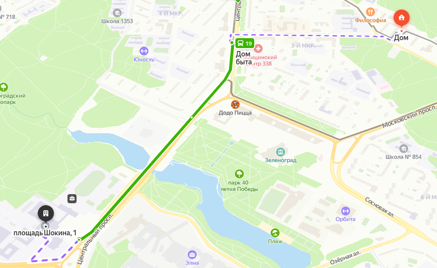

Пешком: либо вдоль прошлого маршрута через ост. Дом Быта, либо через дворы.

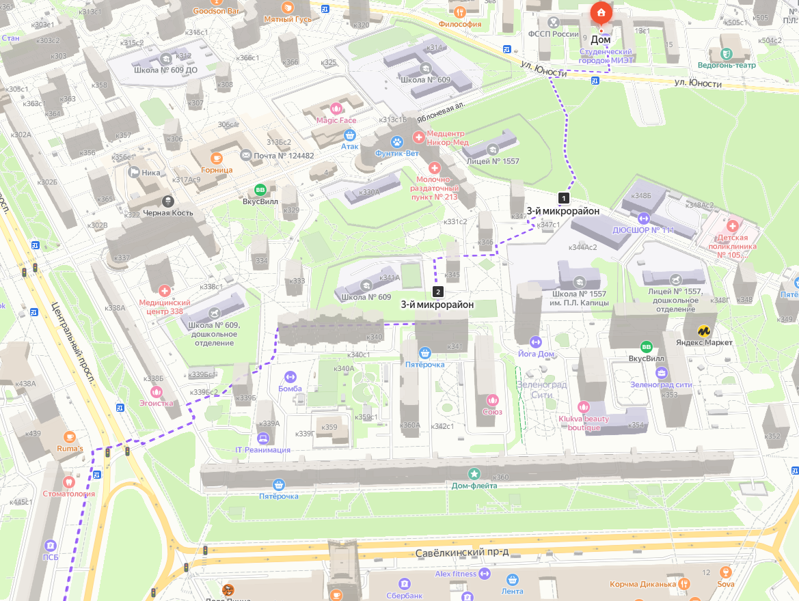

Дальше по мосту.

__До Москвы (м. Ховрино)__:

Дойти до ост. Московский проспект: либо по ул.Юности и проспекту, либо: за театром, вдоль школы, через дворы до к.514. Посадка в Москву напротив магазинов через дорогу. __Автобус е41__ следует до м.Ховрино экспрессом без остановок, путь составит 20-25 минут. Обратно едет через ост. Студенческая и ост. Ведогонь театр, то есть высадка прямо у общаги.

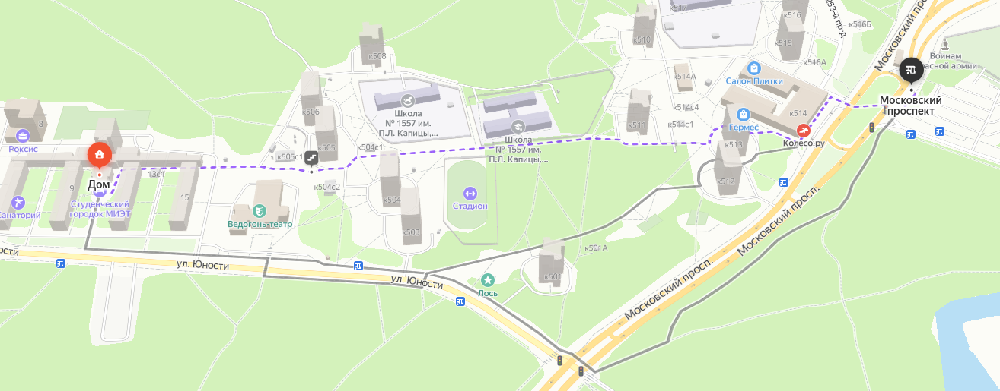

__До Москвы (D3)__:

Ост. Студенческая со стороны Студгородка, автобусы 1, 10, 12 до ост. МЦД Крюково.
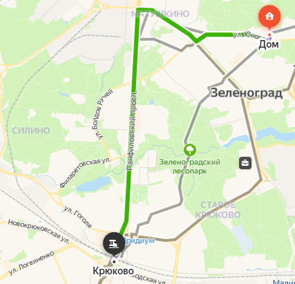

От ост. Дом Быта 3, 3к, 29 до ост. МЦД Крюково. Дальше на станцию МЦД D3.

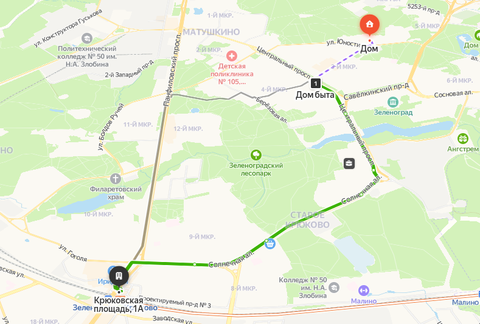

__Оплата в автобусах__: банковская карта, карта Тройка, социальная карта Москвича (выдаются в сентябре) – проездной. Пополнение через приложения в телефоне, терминалы на ост. Океан и м. Ховрино.

## Полезные ссылки

В этом разделе просто перечислю полезные мелочи, которые нужны при существовании в общаге.

* [Светодиодные лампочки  e14/e27 в onlinetrade](https://www.onlinetrade.ru/catalogue/svetodiodnye_lampochki-c4529/?selling[]=7&price1=40&price2=9555&socle[]=E27&socle[]=E14&advanced_search=1&preset_id=0&rating_active=0&special_active=1&selling_active=1&producer_active=1&price_active=0&filamentnie_filament_active=1&dimmiruemaya_active=1&socle_active=1&power_active=1&light_power_active=1&color_t_active=1&forma_lampochki_active=1&voltage_active=1&cat_id=4529) (слегка дешевле чем в розницу)

> *Обратная связь по данному гиту: @wlp5s0 тг/вк Данил*